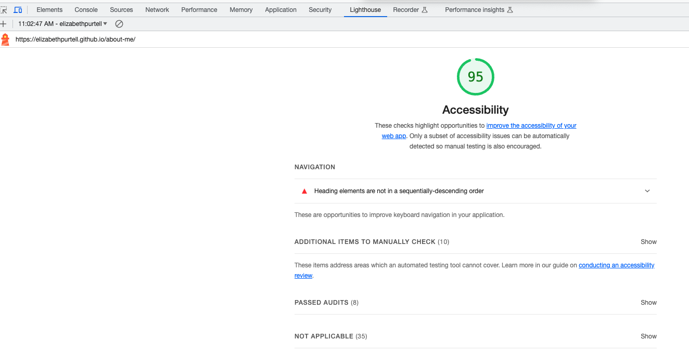

# LAB - 02

## About Me

This website is built to practice my JavaScript skills, User Stories and more.

### Author: Elizabeth Purtell

### Links and Resources

* [CSS Gradient Maker](https://cssgradient.io/)
* [CSS Cheatsheet](https://overapi.com/css)

### Lighthouse Accessibility Report Score

### Reflections and Comments

*How do you see yourself planning and evaluating your learning? What details will you record and/or measure? How often will you evaluate what you want to learn?*

Currently, I plan out my learning based on where I want my career to go. At the same time, I am also adjusting the focus of my learning into contexts that resonate with my interests at the same time. I find it highly important for me to use the information that I am learning at the same time I am learning it. I have learned through years of remote schooling that I learn best by practicing while watching any videos or reading instructions. I will evaluate my needs and wants for learning each time I finish a course, in this way I will be able to keep myself on track not only for a career changes but also for personal interest.
